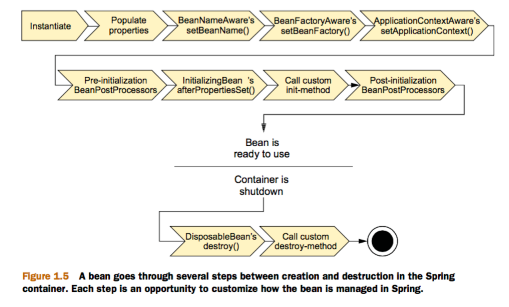

## spring bean 生命周期

    Spring上下文中的Bean也类似，如下:

    1、实例化一个Bean－－也就是我们常说的new；

    2、按照Spring上下文对实例化的Bean进行配置－－也就是IOC注入；

    3、如果这个Bean已经实现了BeanNameAware接口，会调用它实现的setBeanName(String)方法，此处传递的就是Spring配置文件中Bean的id值

    4、如果这个Bean已经实现了BeanFactoryAware接口，会调用它实现的setBeanFactory(setBeanFactory(BeanFactory)传递的是Spring工厂自身（可以用这个方式来获取其它Bean，只需在Spring配置文件中配置一个普通的Bean就可以）；

    5、如果这个Bean已经实现了ApplicationContextAware接口，会调用setApplicationContext(ApplicationContext)方法，传入Spring上下文（同样这个方式也可以实现步骤4的内容，但比4更好，因为ApplicationContext是BeanFactory的子接口，有更多的实现方法）；

    6、如果这个Bean关联了BeanPostProcessor接口，将会调用postProcessBeforeInitialization(Object obj, String s)方法，BeanPostProcessor经常被用作是Bean内容的更改，并且由于这个是在Bean初始化结束时调用那个的方法，也可以被应用于内存或缓存技术；

    7、如果Bean在Spring配置文件中配置了init-method属性会自动调用其配置的初始化方法。

    8、如果这个Bean关联了BeanPostProcessor接口，将会调用postProcessAfterInitialization(Object obj, String s)方法、；

    注：以上工作完成以后就可以应用这个Bean了，那这个Bean是一个Singleton的，所以一般情况下我们调用同一个id的Bean会是在内容地址相同的实例，当然在Spring配置文件中也可以配置非Singleton，这里我们不做赘述。

    9、当Bean不再需要时，会经过清理阶段，如果Bean实现了DisposableBean这个接口，会调用那个其实现的destroy()方法；

    10、最后，如果这个Bean的Spring配置中配置了destroy-method属性，会自动调用其配置的销毁方法。

    以上10步骤可以作为面试或者笔试的模板，另外我们这里描述的是应用Spring上下文Bean的生命周期，如果应用Spring的工厂也就是BeanFactory的话去掉第5步就Ok了。

